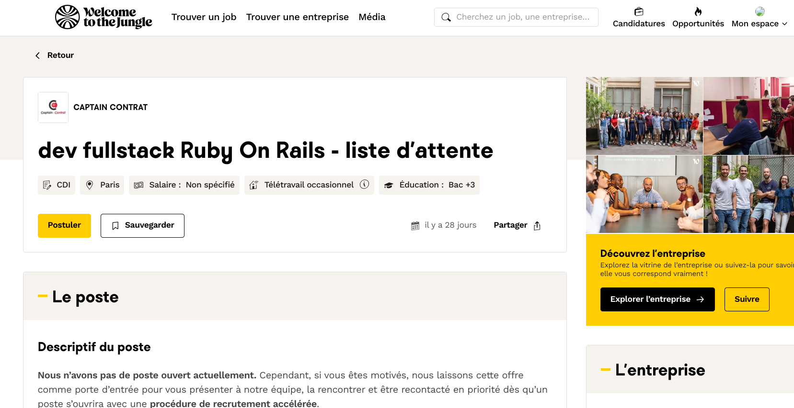

## Analyse des annonces  “spontanées” ROR 

Identification et analyse d’annonces de type “liste d’attente” ou “candidature spontanée” (ex : Captain Contrat, Welcome to the Jungle, mai 2025), qui exigent systématiquement 2 ans d’expérience minimum, rendant ces démarches inaccessibles pour un profil junior.
Justification documentée de l’impossibilité de candidater même en spontané sur le marché RoR.

 Même pour une candidature spontanée, les exigences du marché Ruby on Rails sont tellement élevées que je ne peux pas candidater “en spontané” de façon crédible. La barre d’entrée reste trop haute pour un profil junior, surtout avec les critères réels demandés par les entreprises, comme l’illustre parfaitement l’annonce Captain Contrat :
Ils exigent Bac+3 et au moins 2 ans d’expérience en Ruby on Rails en entreprise et en équipe, même pour une “candidature spontanée” ou une “liste d’attente”.
Ce n’est pas une simple porte ouverte à tous les profils motivés : ils attendent déjà un niveau confirmé, ce qui exclut de fait les débutants ou les profils en reconversion, même très motivés et formés en bootcamp.
La majorité des entreprises qui acceptent des candidatures spontanées dans le numérique font la même chose : elles filtrent sur l’expérience, et la “spontanée” n’est en réalité accessible qu’aux profils déjà expérimentés.

Voici un exemple d’annonce sur Welcome to the Jungle (Captain Contrat) : il s’agit d’une candidature spontanée déguisée, sans poste ouvert ni processus de recrutement réel.
Ce type de pratique fausse la réalité du marché : il n’est pas possible de postuler à un poste existant, ni d’espérer une suite concrète.

 

