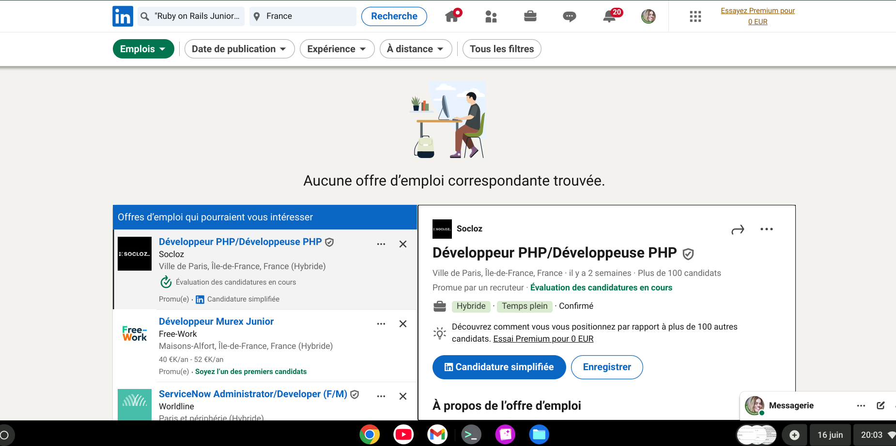
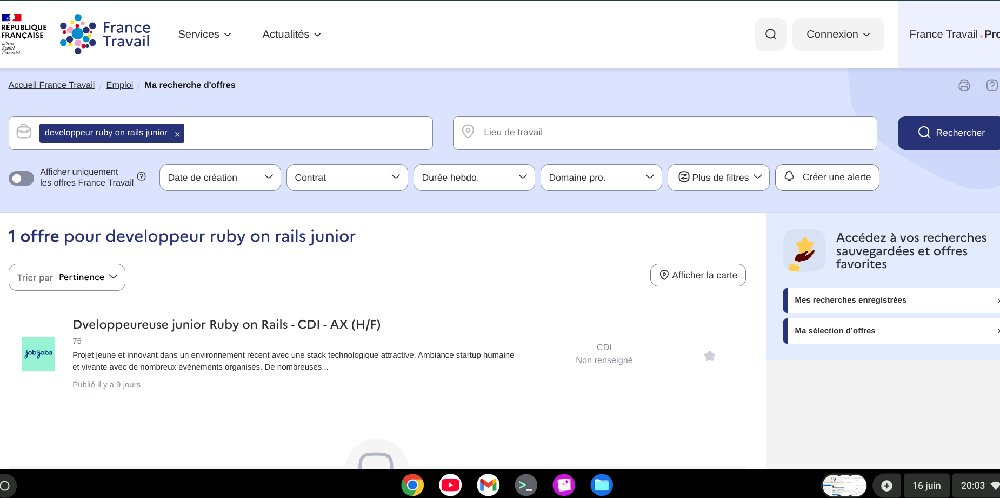
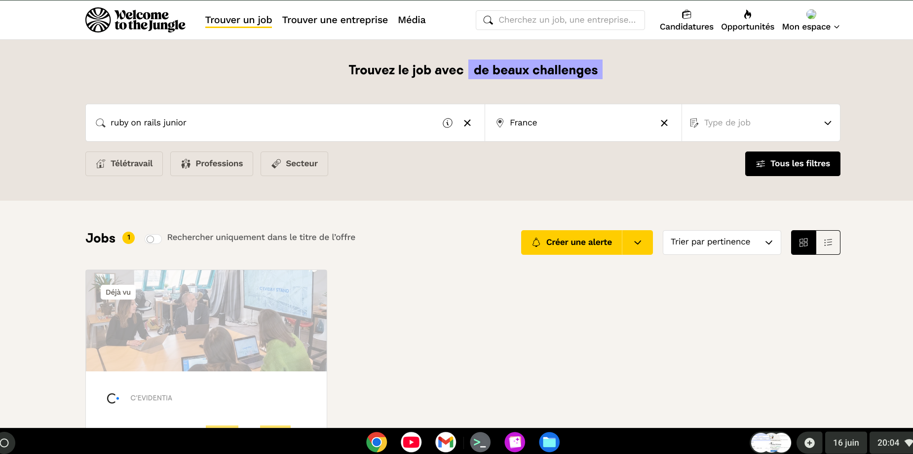
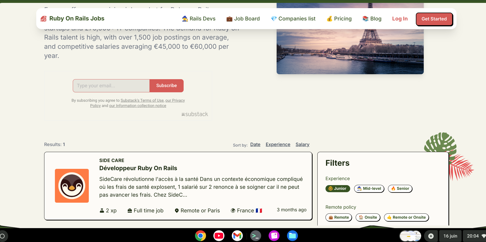
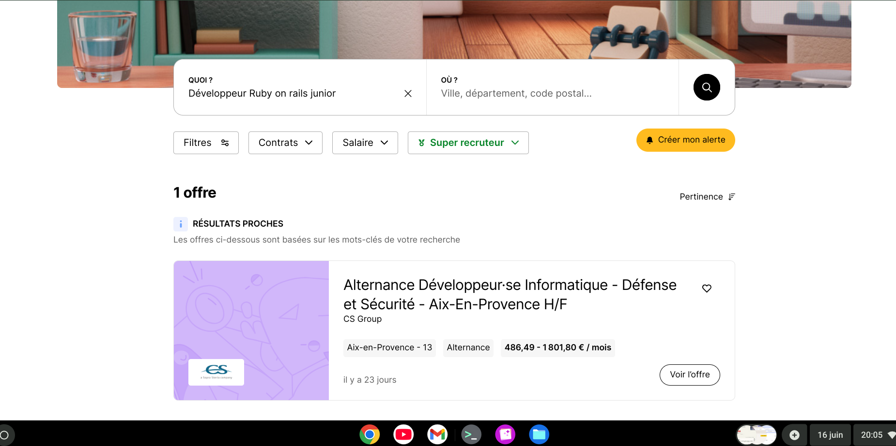
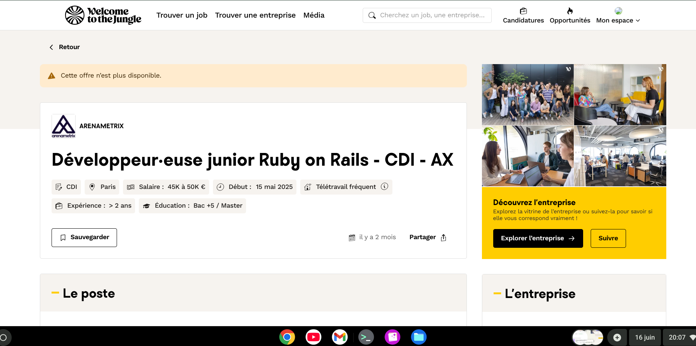

### 🔹 Analyse du marché Ruby on Rails – 16 juin Juin 2025

Dans le cadre de ma veille mensuelle, j’ai effectué une recherche ciblée mi-juin 2025 sur les principales plateformes d’emploi (Welcome to the Jungle, LinkedIn, Indeed, etc.), en filtrant spécifiquement sur :

- les postes Ruby on Rails en France,
- les intitulés mentionnant explicitement un niveau **junior** ou **débutant**.

📌 Résultat : **aucune offre publiée** correspondant à ces critères.

📸 Captures associées ci-dessous : elles illustrent uniquement les recherches qui ont retourné **zéro résultat**.

  
  
  
  
  

➡️ Ce constat renforce l’analyse d’un **marché bloqué pour les juniors Ruby on Rails**, en contradiction avec les discours sur les prétendues pénuries de développeurs.
