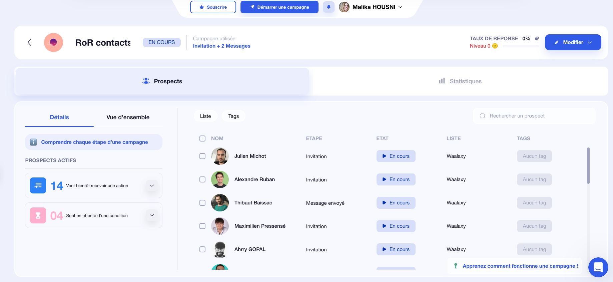
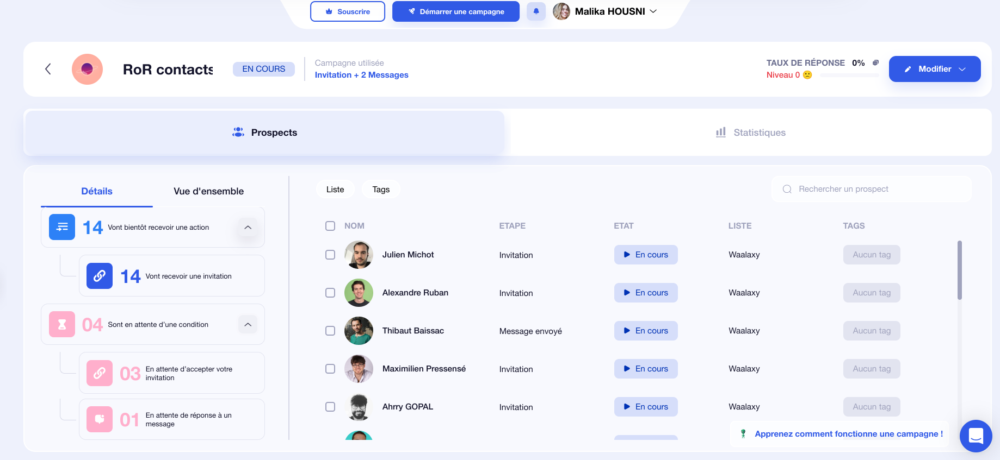
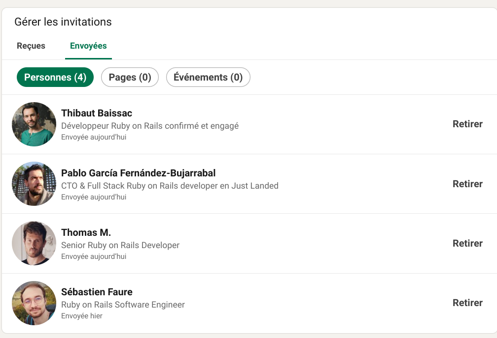

message :

Bonjour [Prénom],
Je suis développeuse junior RoR (portfolio GitHub : [https://github.com/joupify]).
Pourriez-vous m'accorder 2 conseils sur :

Comment percer sans expérience ?

Des entreprises ouvertes aux juniors ?
Merci d'avance pour votre aide !
Malika
