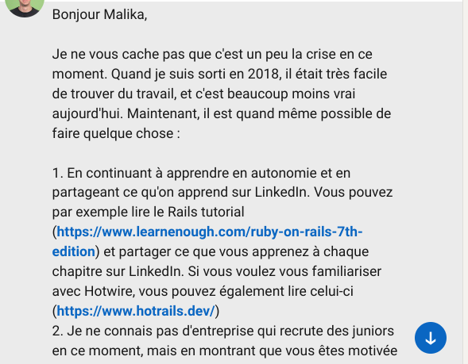
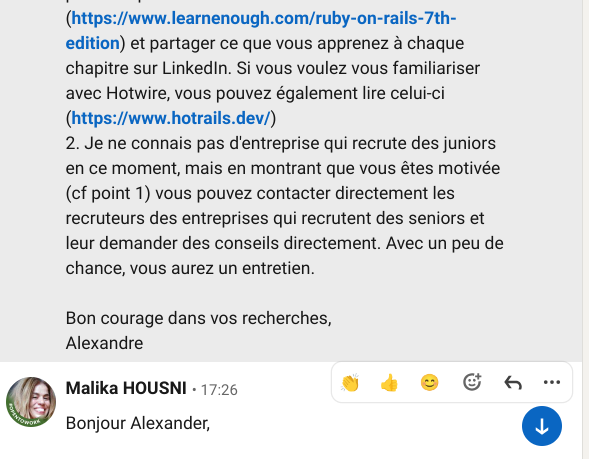
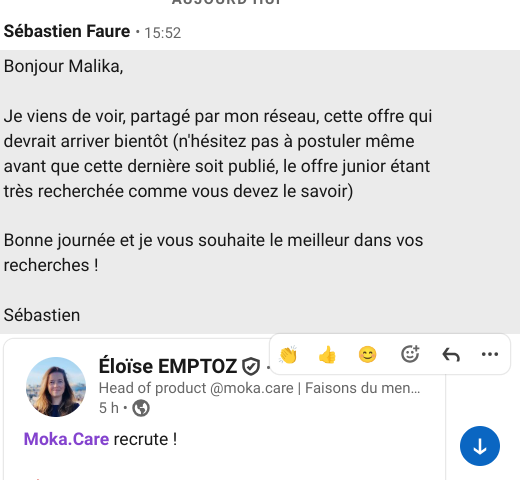
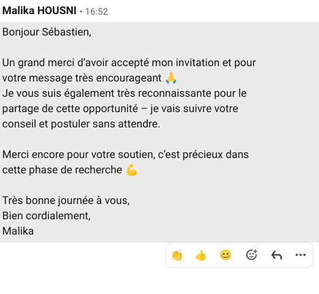
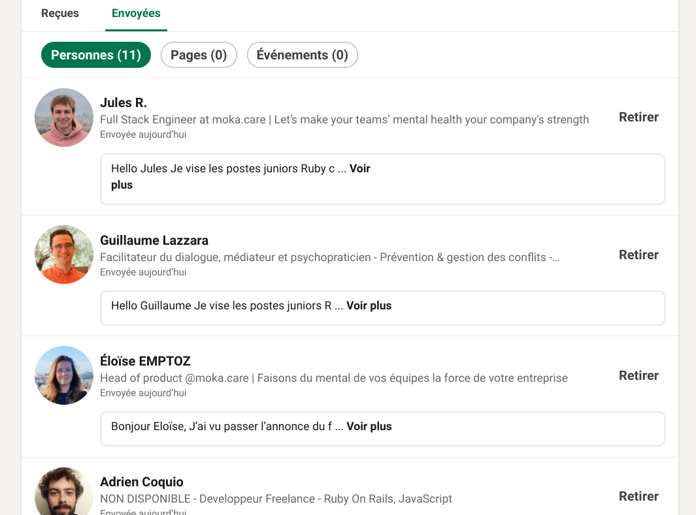
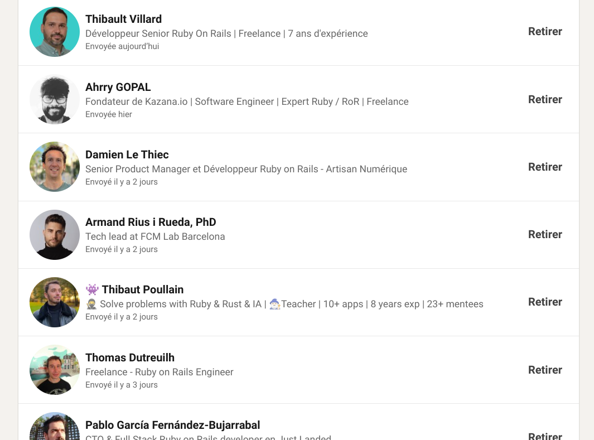

# 🔹 Candidatures spontanées LinkedIn – envois d'invitations avec message

# 📅 Date : 15 juin 2025

## 🤝 Invitations et échanges LinkedIn

### 📩 Échange avec Alexandre Ruban
  
  
  

→ Alexandre a accepté mon invitation et a partagé des conseils sur la veille technique : relire le Rails Tutorial et Hotrails.dev, publier régulièrement sur LinkedIn, et contacter des recruteurs même si aucune offre junior n'est publiée.  
✅ Réponse envoyée avec remerciements et intégration des ressources dans mon plan de veille.

---

### 📩 Échange avec Sébastien [Nom de famille si souhaité]
  
  

→ Sébastien m’a transmis en avant-première une opportunité *Junior Software Engineer* chez **Moka.Care**, non encore publiée. Il m’a encouragée à postuler avant même la diffusion officielle, en soulignant que les profils juniors sont rares et recherchés.  
✅ Message de remerciement envoyé, avec veille active sur leur site et réseau.

---

### 📩 Invitation acceptée /message à Inès Alvergne
  

→ Invitation LinkedIn envoyée et acceptée + message  à Inès (profil tech RH identifié), dans le cadre de ma veille réseau. En attente de réponse pour échange éventuel.

---

### 📩 14 Autres invitations LinkedIn – Campagne ciblée
  
  

→ Envoi groupé d’invitations à des profils identifiés dans l’écosystème Ruby on Rails et recrutement tech. Objectif : activer mon réseau, identifier des opportunités cachées, et initier des échanges directs malgré l'absence d'offres visibles pour juniors.

---

# 📅 Date : 12 juin 2025
### 🎯 Objectif : Élargir son réseau professionnel en Ruby on Rails en ciblant des profils CTO / Tech Leads via LinkedIn (envoi de 14 invitations personnalisées).
### 📌 Méthode : Utilisation de Wallaxy pour automatiser l'envoi d'invitations avec un message intégré.

### 🖼️ Captures d'écran – preuves d'envoi

💬 Message envoyé avec l’invitation

Bonjour [Prénom],

Je suis développeuse junior RoR (portfolio GitHub : https://github.com/joupify).
Pourriez-vous m'accorder 2 conseils sur :

1. Comment percer sans expérience ?
2. Des entreprises ouvertes aux juniors ?

Merci d'avance pour votre aide !  
Malika
